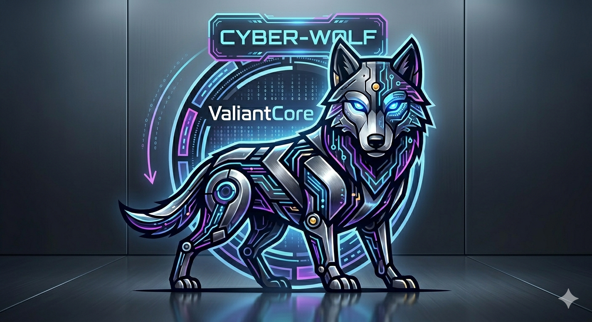

# ValiantCore
Welcome, ValiantCore's mascot CYBER-WOLF!




```text
 __     __    _    _       ___  _   _  _____    ____  ___  ____  _____ 
 \ \   / /   / \  | |      | | | \ | ||_   _|  / ___|/ _ \|  _ \| ____|
  \ \ / /   / _ \ | |      | | |  \| |  | |   | |   | | | | |_) |  _|  
   \ V /   / ___ \| |___   | | | |\  |  | |   | |___| |_| |  _ <| |___ 
    \_/   /_/   \_\_____| |___||_| \_|  |_|    \____|\___/|_| \_\_____|

                 [ ValiantCore 0.5 Beta | x86_64 ]
About the Project

This is a hobby kernel project built from scratch with zero budget. What makes this project unique is that it is being developed entirely on an Android device. It represents a journey of pushing the limits of mobile development environments to create a functional system architecture.


🛠 Features (v0.5 Beta)

Architecture: Full migration to x86_64.


Hardware Protection: System security integrated with hardware chip logic.


Memory & Storage: Virtual File System (VFS) with /boot and /system support. 250GB local disk integration.


Low-Level Mastery: Direct communication with processor registers, IDT (Interrupt Descriptor Table) management, and split interrupt handling.


System Calls: Core system calls are implemented and active.


💡 Open Source & Contribution

This project is open to everyone! Feel free to:


Use the code for your own learning.


Fork the repository and experiment.


Contribute by submitting pull requests or reporting issues.


Developed with passion by **Bıgpower — proof that you don't need a high-end PC to build low-level systems.


